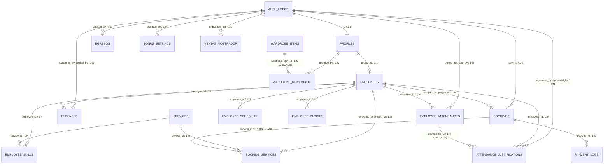

# Auditoría Técnica Integral de Supabase

**Proyecto Supabase:** `acicaladossiu`  
**Project Ref / ID:** `flnqzaybqaqwptujtgzl`  
**Host de Base de Datos:** `db.flnqzaybqaqwptujtgzl.supabase.co`  
**Motor / Versión:** PostgreSQL 17.6.1.127 (Supabase Engine 17 - GA)  
**Región:** `us-east-2` (Ohio, US)  
**Estado del Proyecto:** `ACTIVE_HEALTHY`  
**Fecha de Auditoría:** Septiembre 2026  
**Modo de Ejecución:** Estricto Sólo Lectura (`READ-ONLY`) — Sin modificaciones en esquema ni datos.

---

## Índice

1. [Resumen Ejecutivo e Inventario de Objetos](#1-resumen-ejecutivo-e-inventario-de-objetos)
2. [Esquemas, Extensiones y Tipos](#2-esquemas-extensiones-y-tipos)
3. [Tablas, Columnas, Defaults, Constraints e Índices](#3-tablas-columnas-defaults-constraints-e-índices)
4. [Relaciones y Diagrama Entidad-Relación (Mermaid)](#4-relaciones-y-diagrama-entidad-relación-mermaid)
5. [Row Level Security (RLS) y Políticas Completas](#5-row-level-security-rls-y-políticas-completas)
6. [Funciones, RPC, Triggers y Automatizaciones](#6-funciones-rpc-triggers-y-automatizaciones)
7. [Vínculos e Integración con Supabase Auth](#7-vínculos-e-integración-con-supabase-auth)
8. [Supabase Storage: Buckets, Políticas y Referencias](#8-supabase-storage-buckets-políticas-y-referencias)
9. [Realtime, Edge Functions, Cron, Webhooks e Integraciones](#9-realtime-edge-functions-cron-webhooks-e-integraciones)
10. [Hallazgos de Seguridad, Rendimiento y Componentes Inaccesibles](#10-hallazgos-de-seguridad-rendimiento-y-componentes-inaccesibles)

---

## 1. Resumen Ejecutivo e Inventario de Objetos

La infraestructura de base de datos de **Acicalados Spa & Barber Shop** está desplegada sobre Supabase PostgreSQL 17. El sistema opera un esquema híbrido de gestión de citas y reservas, control de personal y asistencias, inventario de vestuario y catálogo de productos, registro financiero de ventas y gastos de caja chica, y configuración de negocio.

### Conteo Global de Objetos Documentados

| Categoría de Objeto | Cantidad | Detalle Principal |
| :--- | :---: | :--- |
| **Esquemas de Base de Datos** | 11 | `public`, `private`, `auth`, `storage`, `cron`, `realtime`, `vault`, `extensions`, `graphql`, `graphql_public`, `supabase_migrations` |
| **Extensiones PostgreSQL** | 6 | `pg_cron`, `pg_stat_statements`, `pgcrypto`, `plpgsql`, `supabase_vault`, `uuid-ossp` |
| **Tipos de Datos y Dominios** | 22 | 22 tipos compuestos asociados a tablas y validaciones de dominio vía CHECK |
| **Tablas en Esquema `public`** | 22 | 100% con RLS habilitado (1,843 registros totales activos) |
| **Columnas Documentadas** | 167 | Detalle exhaustivo de tipos, nulabilidad, defaults y checks |
| **Restricciones de Llave Primaria (PK)** | 22 | 1 PK por cada tabla en `public` |
| **Restricciones Unique (U)** | 10 | Unicidades compuestas y directas (slugs, códigos, días, fechas) |
| **Restricciones de Llave Foránea (FK)** | 28 | 10 a `auth.users`, 2 a `public.profiles`, 16 entre tablas de negocio |
| **Restricciones de Verificación (CHECK)** | 26 | Validaciones de enumeración de estados, rangos de montos y porcentajes |
| **Índices de Base de Datos** | 52 | 22 índices primarios/unique y 30 índices btree secundarios y parciales |
| **Políticas de Seguridad RLS (`public`)** | 57 | Cobertura granular por roles (`anon`, `authenticated`, `admin`, `recepcionista`, `empleado`, `cliente`) |
| **Políticas de Seguridad RLS (`storage`)** | 5 | Políticas SELECT en `storage.objects` para lectura pública |
| **Funciones Almacenadas (PL/pgSQL / SQL)** | 8 | 1 en `private` (`get_user_role`), 7 en `public` (4 Security Definer) |
| **Event Triggers (DDL)** | 1 | `ensure_rls` en `ddl_command_end` -> `rls_auto_enable()` |
| **Triggers de Base de Datos** | 15 | 1 en `auth.users`, 14 en tablas de `public` (control de timestamps, sincronización de horarios y pagos) |
| **Buckets de Supabase Storage** | 4 | `services-images`, `wardrobe-images`, `products-images`, `gallery-images` (739 archivos) |
| **Tablas en Realtime Publication** | 8 | Suscritas a `supabase_realtime` para sincronización en vivo |
| **Trabajos Programados (pg_cron)** | 1 | `expire-stale-bookings` ejecutado cada 5 minutos |
| **Edge Functions Desplegadas** | 0 | Toda la lógica de servidor opera a través de Next.js Route Handlers |
| **Migraciones Registradas en DB** | 2 | `allow_mixed_service_type` y `add_comprobante_and_billing_fields_to_bookings` |

---

## 2. Esquemas, Extensiones y Tipos

### 2.1 Esquemas de Base de Datos

| Esquema | Propietario / Permisos | Propósito dentro de la Arquitectura |
| :--- | :--- | :--- |
| `public` | `postgres` / `anon`, `authenticated`, `service_role` (USAGE) | Esquema principal de la aplicación con todas las tablas del negocio. |
| `private` | `postgres` / `authenticated` (USAGE) | Esquema reservado de seguridad interna. Aloja la función crítica `private.get_user_role()`. El rol `anon` no tiene acceso a este esquema. |
| `auth` | `supabase_admin` | Motor de autenticación de Supabase (usuarios, sesiones, identidades, MFA, auditoría). |
| `storage` | `supabase_admin` / `anon`, `authenticated`, `service_role` | Motor de almacenamiento de archivos binarios (buckets, objetos, uploads S3 multipart). |
| `cron` | `postgres` | Programador de tareas en segundo plano manejado por la extensión `pg_cron`. |
| `realtime` | `supabase_admin` | Motor de publicación/suscripción WebSocket (CDC). |
| `vault` | `supabase_admin` | Almacén encriptado de secretos y claves criptográficas. |
| `extensions` | `postgres` | Esquema contenedor de extensiones nativas y contribuciones. |
| `graphql` / `graphql_public` | `supabase_admin` | Endpoints y soporte para consultas GraphQL nativas de Supabase. |
| `supabase_migrations` | `postgres` | Registro de trazabilidad y ejecución de migraciones de la plataforma. |

### 2.2 Extensiones Instaladas

| Extensión | Versión | Esquema de Instalación | Descripción y Uso en el Sistema |
| :--- | :---: | :---: | :--- |
| **`pg_cron`** | 1.6.4 | `pg_catalog` | Programador de trabajos basado en cron dentro de PostgreSQL. Ejecuta la liberación de reservas expiradas. |
| **`pg_stat_statements`** | 1.11 | `extensions` | Monitoreo y rastreo de estadísticas de ejecución y rendimiento de consultas SQL. |
| **`pgcrypto`** | 1.3 | `extensions` | Funciones criptográficas y hashing (soporta generación de bytes aleatorios para códigos de reserva). |
| **`plpgsql`** | 1.0 | `pg_catalog` | Lenguaje procedural nativo para triggers y stored procedures. |
| **`supabase_vault`** | 0.3.1 | `vault` | Gestión de secretos sensibles integrada al ecosistema de Supabase. |
| **`uuid-ossp`** | 1.1 | `extensions` | Generación de identificadores universales únicos (UUIDv4). |

### 2.3 Tipos de Datos y Enumeraciones

El sistema implementa tipos compuestos de fila generados para cada tabla del esquema `public`. Las enumeraciones de dominio de negocio no fueron creadas como tipos ENUM estáticos (`CREATE TYPE ... AS ENUM`), sino modeladas mediante columnas de tipo `text` / `varchar` protegidas por restricciones `CHECK`, facilitando la extensibilidad sin migraciones de tipos DDL bloqueantes:

- **Roles de usuario (`profiles.role`):** `'admin'`, `'recepcionista'`, `'empleado'`, `'cliente'`.
- **Tipo de empleado (`employees.type`):** `'barberia'`, `'spa'`, `'recepcionista'`.
- **Tipo de servicio (`services.type` / `bookings.service_type`):** `'barberia'`, `'spa'`, `'mixto'`.
- **Estado de reserva (`bookings.status`):** `'borrador'`, `'pendiente'`, `'confirmada'`, `'completada'`, `'cancelada'`, `'expirada'`.
- **Estado de pago de reserva (`bookings.payment_status`):** `'sin_pago'`, `'parcial'`, `'total'`.
- **Método de pago (`payment_logs.payment_method`):** `'yape'`, `'efectivo'`, `'cash'`, `'transferencia'`, `'mixto'`, `'mixed'`, `'culqi_legacy'`.
- **Tipo de pago registrado (`payment_logs.payment_type`):** `'advance'`, `'partial'`, `'balance'`, `'full'`, `'total'`, `'refund'`, `'legacy'`.
- **Estado de verificación de pago (`payment_logs.status`):** `'pending'`, `'verified'`, `'rejected'`, `'voided'`, `'legacy_unclassified'`.
- **Estado de prenda de vestuario (`wardrobe_items.availability_status`):** `'disponible'`, `'reservado'`, `'en_uso'`, `'en_mantenimiento'`.
- **Estado de movimiento de vestuario (`wardrobe_movements.status`):** `'reservado'`, `'devuelto'`.
- **Estado de asistencia (`employee_attendances.status`):** `'presente'`, `'tardanza'`, `'salida_temprana'`, `'falta_justificada'`, `'falta_injustificada'`, `'en_permiso'`.
- **Tipo de justificación (`attendance_justifications.type`):** `'check_in'`, `'check_out'`, `'absence'`.
- **Estado de justificación (`attendance_justifications.status`):** `'pending'`, `'approved'`, `'rejected'`.
- **Método de redondeo de bono (`bonus_settings.rounding_method`):** `'none'`, `'nearest_5'`, `'floor_5'`.
- **Método de pago de mostrador (`ventas_mostrador.metodo_pago`):** `'Efectivo'`, `'Yape'`, `'Transferencia'`, `'Mixto'`.
- **Tipo de comprobante electrónico (`bookings.comprobante_tipo`):** `'03'` (Boleta), `'01'` (Factura).

---

## 3. Tablas, Columnas, Defaults, Constraints e Índices

Todas las tablas se encuentran en el esquema `public` y cuentan con RLS habilitado de forma obligatoria.

### 3.1 `public.profiles` (9 filas)
Perfil extendido de usuarios sincronizado bidireccionalmente con `auth.users`.

- **Columnas:**
  - `id` (`uuid`, NOT NULL, PK) -> Referencia `auth.users(id)` ON DELETE CASCADE.
  - `first_name` (`text`, NULL)
  - `last_name` (`text`, NULL)
  - `phone` (`text`, NULL)
  - `dni` (`text`, NULL)
  - `role` (`text`, NOT NULL, DEFAULT `'cliente'::text`) -> CHECK `role IN ('admin', 'recepcionista', 'empleado', 'cliente')`.
  - `is_profile_complete` (`boolean`, NOT NULL, DEFAULT `false`)
  - `avatar_url` (`text`, NULL)
  - `created_at` (`timestamptz`, NOT NULL, DEFAULT `now()`)
  - `updated_at` (`timestamptz`, NOT NULL, DEFAULT `now()`)
- **Constraints:**
  - PK: `profiles_pkey (id)`
  - FK: `profiles_id_fkey (id) REFERENCES auth.users(id) ON DELETE CASCADE`
  - CHECK: `profiles_role_check`
- **Índices:**
  - `profiles_pkey` UNIQUE btree (id)
  - `profiles_role_idx` btree (role)
  - `profiles_phone_idx` btree (phone) WHERE phone IS NOT NULL
  - `profiles_dni_idx` btree (dni) WHERE dni IS NOT NULL
- **Triggers:**
  - `set_updated_at` BEFORE UPDATE -> `handle_updated_at()`

---

### 3.2 `public.business_config` (1 fila)
Parámetros globales del negocio, políticas de cobro de adelanto y redes sociales.

- **Columnas:**
  - `id` (`bigint`, NOT NULL, PK, GENERATED ALWAYS AS IDENTITY)
  - `advance_percentage` (`integer`, NOT NULL, DEFAULT `30`) -> CHECK `>= 1 AND <= 100`
  - `business_name` (`text`, NOT NULL, DEFAULT `'Acicalados Spa & Barber Shop'::text`)
  - `whatsapp_url` (`text`, NULL, DEFAULT `'https://wa.me/'::text`)
  - `instagram_url` (`text`, NULL)
  - `facebook_url` (`text`, NULL)
  - `tiktok_url` (`text`, NULL)
  - `youtube_url` (`text`, NULL)
  - `google_maps_url` (`text`, NULL, DEFAULT `'https://maps.app.goo.gl/9ojPm9qdawhvqEYu9'::text`)
  - `opening_hours` (`jsonb`, NULL, DEFAULT `'{}'::jsonb`)
  - `created_at` (`timestamptz`, NOT NULL, DEFAULT `now()`)
  - `updated_at` (`timestamptz`, NOT NULL, DEFAULT `now()`)
- **Constraints:**
  - PK: `business_config_pkey (id)`
  - CHECK: `business_config_advance_percentage_check`
- **Índices:**
  - `business_config_pkey` UNIQUE btree (id)
- **Triggers:**
  - `set_updated_at` BEFORE UPDATE -> `handle_updated_at()`

---

### 3.3 `public.services` (158 filas)
Catálogo maestro de servicios ofrecidos en Barbería y Spa.

- **Columnas:**
  - `id` (`uuid`, NOT NULL, PK, DEFAULT `gen_random_uuid()`)
  - `name` (`text`, NOT NULL)
  - `slug` (`text`, NOT NULL, UNIQUE)
  - `description` (`text`, NULL)
  - `type` (`text`, NOT NULL) -> CHECK `type IN ('spa', 'barberia')`
  - `price_cents` (`integer`, NOT NULL) -> CHECK `>= 0`
  - `currency` (`text`, NOT NULL, DEFAULT `'PEN'::text`)
  - `duration_minutes` (`integer`, NOT NULL) -> CHECK `> 0`
  - `capacity` (`integer`, NOT NULL, DEFAULT `1`) -> CHECK `>= 1`
  - `staff_required` (`integer`, NOT NULL, DEFAULT `1`) -> CHECK `>= 1`
  - `is_public` (`boolean`, NOT NULL, DEFAULT `true`)
  - `is_active` (`boolean`, NOT NULL, DEFAULT `true`)
  - `images` (`text[]`, NOT NULL, DEFAULT `'{}'::text[]`)
  - `attributes` (`jsonb`, NULL, DEFAULT `'{}'::jsonb`)
  - `sort_order` (`integer`, NOT NULL, DEFAULT `0`)
  - `created_at` (`timestamptz`, NOT NULL, DEFAULT `now()`)
  - `updated_at` (`timestamptz`, NOT NULL, DEFAULT `now()`)
- **Constraints:**
  - PK: `services_pkey (id)`
  - UNIQUE: `services_slug_key (slug)`
  - CHECK: `services_type_check`, `services_price_cents_check`, `services_duration_minutes_check`, `services_capacity_check`, `services_staff_required_check`
- **Índices:**
  - `services_pkey` UNIQUE btree (id)
  - `services_slug_key` / `services_slug_idx` UNIQUE / btree (slug)
  - `services_sort_order_idx` btree (sort_order)
  - `services_type_active_idx` btree (type) WHERE is_active = true AND is_public = true
- **Triggers:**
  - `set_updated_at` BEFORE UPDATE -> `handle_updated_at()`

---

### 3.4 `public.employees` (11 filas)
Colaboradores y personal operativo del establecimiento.

- **Columnas:**
  - `id` (`uuid`, NOT NULL, PK, DEFAULT `gen_random_uuid()`)
  - `profile_id` (`uuid`, NULL) -> Referencia `public.profiles(id)` ON DELETE SET NULL
  - `first_name` (`text`, NOT NULL)
  - `last_name` (`text`, NOT NULL)
  - `type` (`text`, NOT NULL) -> CHECK `type IN ('barberia', 'spa', 'recepcionista')`
  - `is_active` (`boolean`, NOT NULL, DEFAULT `true`)
  - `rotation_order` (`integer`, NOT NULL, DEFAULT `0`)
  - `created_at` (`timestamptz`, NOT NULL, DEFAULT `now()`)
  - `updated_at` (`timestamptz`, NOT NULL, DEFAULT `now()`)
- **Constraints:**
  - PK: `employees_pkey (id)`
  - FK: `employees_profile_id_fkey (profile_id) REFERENCES profiles(id) ON DELETE SET NULL`
  - CHECK: `employees_type_check`
- **Índices:**
  - `employees_pkey` UNIQUE btree (id)
  - `employees_profile_id_idx` btree (profile_id) WHERE profile_id IS NOT NULL
  - `employees_type_active_idx` btree (type) WHERE is_active = true
- **Triggers:**
  - `set_updated_at` BEFORE UPDATE -> `handle_updated_at()`

---

### 3.5 `public.employee_skills` (260 filas)
Matriz N:M de asignación de servicios que cada empleado está calificado para prestar.

- **Columnas:**
  - `id` (`uuid`, NOT NULL, PK, DEFAULT `gen_random_uuid()`)
  - `employee_id` (`uuid`, NOT NULL) -> Referencia `public.employees(id)` ON DELETE CASCADE
  - `service_id` (`uuid`, NOT NULL) -> Referencia `public.services(id)` ON DELETE CASCADE
  - `assigned_at` (`timestamptz`, NOT NULL, DEFAULT `now()`)
- **Constraints:**
  - PK: `employee_skills_pkey (id)`
  - UNIQUE: `employee_skills_employee_id_service_id_key (employee_id, service_id)`
  - FK: `employee_skills_employee_id_fkey REFERENCES employees(id) ON DELETE CASCADE`
  - FK: `employee_skills_service_id_fkey REFERENCES services(id) ON DELETE CASCADE`
- **Índices:**
  - `employee_skills_pkey` UNIQUE btree (id)
  - `employee_skills_employee_id_service_id_key` UNIQUE btree (employee_id, service_id)
  - `employee_skills_employee_idx` btree (employee_id)
  - `employee_skills_service_idx` btree (service_id)

---

### 3.6 `public.employee_schedules` (0 filas)
Horarios base regulares semanales por colaborador.

- **Columnas:**
  - `id` (`uuid`, NOT NULL, PK, DEFAULT `gen_random_uuid()`)
  - `employee_id` (`uuid`, NOT NULL) -> Referencia `public.employees(id)` ON DELETE CASCADE
  - `day_of_week` (`smallint`, NOT NULL) -> CHECK `>= 0 AND <= 6` (0 = Domingo, 6 = Sábado)
  - `start_time` (`time`, NOT NULL)
  - `end_time` (`time`, NOT NULL)
  - `is_active` (`boolean`, NOT NULL, DEFAULT `true`)
  - `created_at` (`timestamptz`, NOT NULL, DEFAULT `now()`)
- **Constraints:**
  - PK: `employee_schedules_pkey (id)`
  - UNIQUE: `employee_schedules_employee_id_day_of_week_key (employee_id, day_of_week)`
  - FK: `employee_schedules_employee_id_fkey REFERENCES employees(id) ON DELETE CASCADE`
  - CHECK: `employee_schedules_day_of_week_check`
- **Índices:**
  - `employee_schedules_pkey` UNIQUE btree (id)
  - `employee_schedules_employee_id_day_of_week_key` UNIQUE btree (employee_id, day_of_week)
  - `employee_schedules_employee_day_idx` btree (employee_id, day_of_week)

---

### 3.7 `public.employee_blocks` (0 filas)
Bloqueos de agenda específicos (permisos por fecha/hora o días completos).

- **Columnas:**
  - `id` (`uuid`, NOT NULL, PK, DEFAULT `gen_random_uuid()`)
  - `employee_id` (`uuid`, NOT NULL) -> Referencia `public.employees(id)` ON DELETE CASCADE
  - `block_date` (`date`, NOT NULL)
  - `start_time` (`time`, NULL)
  - `end_time` (`time`, NULL)
  - `reason` (`text`, NULL)
  - `created_at` (`timestamptz`, NOT NULL, DEFAULT `now()`)
- **Constraints:**
  - PK: `employee_blocks_pkey (id)`
  - FK: `employee_blocks_employee_id_fkey REFERENCES employees(id) ON DELETE CASCADE`
- **Índices:**
  - `employee_blocks_pkey` UNIQUE btree (id)
  - `employee_blocks_employee_date_idx` btree (employee_id, block_date)

---

### 3.8 `public.bookings` (353 filas)
Entidad central de reservas y citas de clientes.

- **Columnas:**
  - `id` (`uuid`, NOT NULL, PK, DEFAULT `gen_random_uuid()`)
  - `booking_code` (`text`, NOT NULL, UNIQUE, DEFAULT `encode(extensions.gen_random_bytes(4), 'hex')`)
  - `user_id` (`uuid`, NULL) -> Referencia `auth.users(id)` ON DELETE SET NULL
  - `client_first_name` (`text`, NOT NULL)
  - `client_last_name` (`text`, NOT NULL)
  - `client_phone` (`text`, NULL)
  - `client_email` (`text`, NULL)
  - `client_dni` (`text`, NULL)
  - `service_type` (`text`, NOT NULL) -> CHECK `service_type IN ('barberia', 'spa', 'mixto')`
  - `booking_date` (`date`, NOT NULL)
  - `start_time` (`time`, NOT NULL)
  - `end_time` (`time`, NOT NULL)
  - `total_duration_minutes` (`integer`, NOT NULL) -> CHECK `> 0`
  - `total_price_cents` (`integer`, NOT NULL) -> CHECK `>= 0`
  - `advance_percentage` (`integer`, NOT NULL) -> CHECK `>= 1 AND <= 100`
  - `advance_amount_cents` (`integer`, NOT NULL) -> CHECK `>= 0`
  - `balance_cents` (`integer`, NOT NULL) -> CHECK `>= 0`
  - `status` (`text`, NOT NULL, DEFAULT `'borrador'::text`) -> CHECK `status IN ('borrador', 'pendiente', 'confirmada', 'completada', 'cancelada', 'expirada')`
  - `payment_status` (`text`, NOT NULL, DEFAULT `'sin_pago'::text`) -> CHECK `payment_status IN ('sin_pago', 'parcial', 'total')`
  - `assigned_employee_id` (`uuid`, NULL) -> Referencia `public.employees(id)` ON DELETE SET NULL
  - `culqi_charge_id` (`text`, NULL)
  - `culqi_order_id` (`text`, NULL)
  - `slot_locked_at` (`timestamptz`, NULL)
  - `slot_lock_expires_at` (`timestamptz`, NULL)
  - `confirmed_at` (`timestamptz`, NULL)
  - `completed_at` (`timestamptz`, NULL)
  - `cancelled_at` (`timestamptz`, NULL)
  - `expired_at` (`timestamptz`, NULL)
  - `created_at` (`timestamptz`, NOT NULL, DEFAULT `now()`)
  - `updated_at` (`timestamptz`, NOT NULL, DEFAULT `now()`)
  - `comprobante_tipo` (`text`, NULL) -> CHECK `comprobante_tipo IN ('03', '01')`
  - `comprobante_serie` (`text`, NULL)
  - `comprobante_numero` (`integer`, NULL)
  - `pdf_url` (`text`, NULL)
  - `billing_doc_type` (`text`, NULL)
  - `billing_doc_number` (`text`, NULL)
  - `billing_name` (`text`, NULL)
  - `billing_address` (`text`, NULL)
  - `payment_method` (`text`, NULL)
- **Constraints:**
  - PK: `bookings_pkey (id)`
  - UNIQUE: `bookings_booking_code_key (booking_code)`
  - FK: `bookings_user_id_fkey REFERENCES auth.users(id) ON DELETE SET NULL`
  - FK: `bookings_assigned_employee_id_fkey REFERENCES employees(id) ON DELETE SET NULL`
  - CHECK: `bookings_service_type_check`, `bookings_status_check`, `bookings_payment_status_check`, `bookings_total_duration_minutes_check`, `bookings_total_price_cents_check`, `bookings_advance_percentage_check`, `bookings_advance_amount_cents_check`, `bookings_balance_cents_check`, `bookings_comprobante_tipo_check`
- **Índices:**
  - `bookings_pkey` UNIQUE btree (id)
  - `bookings_booking_code_key` / `bookings_code_idx` UNIQUE / btree (booking_code)
  - `bookings_date_idx` btree (booking_date)
  - `bookings_date_status_idx` btree (booking_date, status)
  - `bookings_status_idx` btree (status)
  - `bookings_created_at_idx` btree (created_at DESC)
  - `bookings_employee_date_idx` btree (assigned_employee_id, booking_date) WHERE status IN ('confirmada', 'completada')
  - `bookings_slot_lock_idx` btree (slot_lock_expires_at) WHERE status = 'pendiente'
  - `bookings_user_id_idx` btree (user_id) WHERE user_id IS NOT NULL
  - `bookings_client_phone_idx` btree (client_phone) WHERE client_phone IS NOT NULL
- **Triggers:**
  - `set_updated_at` BEFORE UPDATE -> `handle_updated_at()`

---

### 3.9 `public.booking_services` (383 filas)
Detalle de servicios contratados en cada reserva (soporta citas multiservicio y asignación individual de empleado y horario).

- **Columnas:**
  - `id` (`uuid`, NOT NULL, PK, DEFAULT `gen_random_uuid()`)
  - `booking_id` (`uuid`, NOT NULL) -> Referencia `public.bookings(id)` ON DELETE CASCADE
  - `service_id` (`uuid`, NULL) -> Referencia `public.services(id)` ON DELETE CASCADE
  - `service_name` (`text`, NOT NULL)
  - `service_price_cents` (`integer`, NOT NULL)
  - `duration_minutes` (`integer`, NOT NULL)
  - `created_at` (`timestamptz`, NOT NULL, DEFAULT `now()`)
  - `assigned_employee_id` (`uuid`, NULL) -> Referencia `public.employees(id)` ON DELETE SET NULL
  - `start_time` (`time`, NULL)
  - `end_time` (`time`, NULL)
  - `hora_inicio` (`time`, NULL)
  - `hora_fin` (`time`, NULL)
  - `status` (`varchar`, NULL, DEFAULT `'confirmada'::character varying`)
  - `liberado_at` (`timestamptz`, NULL)
- **Constraints:**
  - PK: `booking_services_pkey (id)`
  - FK: `booking_services_booking_id_fkey REFERENCES bookings(id) ON DELETE CASCADE`
  - FK: `booking_services_service_id_fkey REFERENCES services(id) ON DELETE CASCADE`
  - FK: `booking_services_assigned_employee_id_fkey REFERENCES employees(id) ON DELETE SET NULL`
- **Índices:**
  - `booking_services_pkey` UNIQUE btree (id)
  - `booking_services_booking_idx` btree (booking_id)
  - `idx_booking_services_booking_id` btree (booking_id) *(Índice redundante/duplicado reportado)*
  - `idx_booking_services_employee_status` btree (assigned_employee_id, status)
  - `idx_booking_services_employee_time` btree (assigned_employee_id, start_time, end_time)
  - `idx_booking_services_status` btree (status)
- **Triggers:**
  - `trg_sync_booking_services_time_ranges` BEFORE INSERT OR UPDATE -> `sync_booking_services_time_ranges()`

---

### 3.10 `public.payment_logs` (329 filas)
Libro mayor de transacciones financieras, pasarelas de pago y validación de comprobantes.

- **Columnas:**
  - `id` (`uuid`, NOT NULL, PK, DEFAULT `gen_random_uuid()`)
  - `booking_id` (`uuid`, NULL) -> Referencia `public.bookings(id)` ON DELETE SET NULL
  - `event_type` (`text`, NULL, DEFAULT `'payment'::text`)
  - `culqi_event_id` (`text`, NULL, UNIQUE)
  - `amount_cents` (`integer`, NULL)
  - `currency` (`text`, NULL, DEFAULT `'PEN'::text`)
  - `payload` (`jsonb`, NULL)
  - `processing_result` (`text`, NULL)
  - `processing_time_ms` (`integer`, NULL)
  - `created_at` (`timestamptz`, NOT NULL, DEFAULT `now()`)
  - `idempotency_key` (`uuid`, NULL)
  - `payment_method` (`text`, NULL) -> CHECK `payment_method IN ('yape', 'efectivo', 'cash', 'transferencia', 'mixto', 'mixed', 'culqi_legacy')`
  - `payment_type` (`text`, NULL, DEFAULT `'full'::text`) -> CHECK `payment_type IN ('advance', 'partial', 'balance', 'full', 'total', 'refund', 'legacy')`
  - `yape_amount_cents` (`integer`, NOT NULL, DEFAULT `0`)
  - `cash_amount_cents` (`integer`, NOT NULL, DEFAULT `0`)
  - `status` (`text`, NOT NULL, DEFAULT `'verified'::text`) -> CHECK `status IN ('pending', 'verified', 'rejected', 'voided', 'legacy_unclassified')`
  - `proof_url` (`text`, NULL)
  - `notes` (`text`, NULL)
  - `paid_at` (`timestamptz`, NULL, DEFAULT `now()`)
  - `registered_by` (`uuid`, NULL)
  - `verified_at` (`timestamptz`, NULL)
  - `verified_by` (`uuid`, NULL)
  - `voided_at` (`timestamptz`, NULL)
  - `voided_by` (`uuid`, NULL)
  - `void_reason` (`text`, NULL)
  - `updated_at` (`timestamptz`, NOT NULL, DEFAULT `now()`)
- **Constraints:**
  - PK: `payment_logs_pkey (id)`
  - UNIQUE: `payment_logs_culqi_event_id_key (culqi_event_id)`
  - FK: `payment_logs_booking_id_fkey REFERENCES bookings(id) ON DELETE SET NULL`
  - CHECK: `chk_payment_method`, `chk_payment_type`, `chk_payment_status`
- **Índices:**
  - `payment_logs_pkey` UNIQUE btree (id)
  - `payment_logs_culqi_event_id_key` UNIQUE btree (culqi_event_id)
  - `payment_logs_booking_idx` btree (booking_id)
  - `payment_logs_event_id_idx` btree (culqi_event_id) WHERE culqi_event_id IS NOT NULL
- **Triggers:**
  - `trg_payment_logs_recalculate` AFTER INSERT OR UPDATE OR DELETE -> `trigger_recalculate_booking_payment()`

---

### 3.11 `public.wardrobe_items` (659 filas)
Inventario de trajes, vestidos y accesorios en alquiler.

- **Columnas:**
  - `id` (`uuid`, NOT NULL, PK, DEFAULT `gen_random_uuid()`)
  - `name` (`text`, NOT NULL)
  - `description` (`text`, NULL)
  - `section` (`text`, NULL)
  - `category` (`text`, NULL, DEFAULT `'Bodas & Matrimonios'::text`)
  - `price_cents` (`integer`, NOT NULL, DEFAULT `0`) -> CHECK `>= 0`
  - `deposit_cents` (`integer`, NOT NULL, DEFAULT `0`)
  - `guarantee_cents` (`integer`, NOT NULL, DEFAULT `0`)
  - `availability_status` (`text`, NOT NULL, DEFAULT `'disponible'::text`) -> CHECK `availability_status IN ('disponible', 'reservado', 'en_uso', 'en_mantenimiento')`
  - `is_active` (`boolean`, NOT NULL, DEFAULT `true`)
  - `images` (`text[]`, NOT NULL, DEFAULT `'{}'::text[]`)
  - `sort_order` (`integer`, NOT NULL, DEFAULT `0`)
  - `created_at` (`timestamptz`, NOT NULL, DEFAULT `now()`)
  - `updated_at` (`timestamptz`, NOT NULL, DEFAULT `now()`)
- **Constraints:**
  - PK: `wardrobe_items_pkey (id)`
  - CHECK: `wardrobe_items_price_cents_check`, `wardrobe_items_availability_status_check`
- **Índices:**
  - `wardrobe_items_pkey` UNIQUE btree (id)
  - `wardrobe_items_status_idx` btree (availability_status) WHERE is_active = true
- **Triggers:**
  - `set_updated_at` BEFORE UPDATE -> `handle_updated_at()`

---

### 3.12 `public.wardrobe_movements` (0 filas)
Registro de alquileres, salidas y devoluciones de vestuario.

- **Columnas:**
  - `id` (`uuid`, NOT NULL, PK, DEFAULT `gen_random_uuid()`)
  - `wardrobe_item_id` (`uuid`, NOT NULL) -> Referencia `public.wardrobe_items(id)` ON DELETE CASCADE
  - `attended_by` (`uuid`, NULL) -> Referencia `public.profiles(id)` ON DELETE SET NULL
  - `occasion` (`text`, NULL)
  - `client_first_name` (`text`, NOT NULL)
  - `client_last_name` (`text`, NOT NULL)
  - `client_dni` (`text`, NULL)
  - `client_phone` (`text`, NULL)
  - `section` (`text`, NULL)
  - `price_cents` (`integer`, NOT NULL, DEFAULT `0`)
  - `advance_cents` (`integer`, NOT NULL, DEFAULT `0`)
  - `guarantee_cents` (`integer`, NOT NULL, DEFAULT `0`)
  - `return_date` (`date`, NULL)
  - `status` (`text`, NOT NULL, DEFAULT `'reservado'::text`) -> CHECK `status IN ('reservado', 'devuelto')`
  - `notes` (`text`, NULL)
  - `created_at` (`timestamptz`, NOT NULL, DEFAULT `now()`)
  - `updated_at` (`timestamptz`, NOT NULL, DEFAULT `now()`)
- **Constraints:**
  - PK: `wardrobe_movements_pkey (id)`
  - FK: `wardrobe_movements_wardrobe_item_id_fkey REFERENCES wardrobe_items(id) ON DELETE CASCADE`
  - FK: `wardrobe_movements_attended_by_fkey REFERENCES profiles(id) ON DELETE SET NULL`
  - CHECK: `wardrobe_movements_status_check`
- **Índices:**
  - `wardrobe_movements_pkey` UNIQUE btree (id)
  - `wardrobe_movements_item_idx` btree (wardrobe_item_id)
- **Triggers:**
  - `set_updated_at` BEFORE UPDATE -> `handle_updated_at()`

---

### 3.13 `public.products` (4 filas)
Productos capilares y estética para venta directa o mostrador.

- **Columnas:**
  - `id` (`uuid`, NOT NULL, PK, DEFAULT `gen_random_uuid()`)
  - `name` (`text`, NOT NULL)
  - `slug` (`text`, NOT NULL, UNIQUE)
  - `description` (`text`, NULL)
  - `category` (`text`, NULL)
  - `price_cents` (`integer`, NOT NULL) -> CHECK `>= 0`
  - `currency` (`text`, NOT NULL, DEFAULT `'PEN'::text`)
  - `stock` (`integer`, NOT NULL, DEFAULT `0`) -> CHECK `>= 0`
  - `is_active` (`boolean`, NOT NULL, DEFAULT `true`)
  - `images` (`text[]`, NOT NULL, DEFAULT `'{}'::text[]`)
  - `features` (`text[]`, NULL, DEFAULT `'{}'::text[]`)
  - `sort_order` (`integer`, NOT NULL, DEFAULT `0`)
  - `created_at` (`timestamptz`, NOT NULL, DEFAULT `now()`)
  - `updated_at` (`timestamptz`, NOT NULL, DEFAULT `now()`)
- **Constraints:**
  - PK: `products_pkey (id)`
  - UNIQUE: `products_slug_key (slug)`
  - CHECK: `products_price_cents_check`, `products_stock_check`
- **Índices:**
  - `products_pkey` UNIQUE btree (id)
  - `products_slug_key` / `products_slug_idx` UNIQUE / btree (slug)
  - `products_active_idx` btree (is_active) WHERE is_active = true
  - `products_category_idx` btree (category) WHERE is_active = true
- **Triggers:**
  - `set_updated_at` BEFORE UPDATE -> `handle_updated_at()`

---

### 3.14 `public.employee_attendances` (135 filas)
Marcaciones de asistencia diaria (check-in / check-out), tardanzas y cómputo de bonos.

- **Columnas:**
  - `id` (`uuid`, NOT NULL, PK, DEFAULT `gen_random_uuid()`)
  - `employee_id` (`uuid`, NOT NULL) -> Referencia `public.employees(id)` ON DELETE CASCADE
  - `date` (`date`, NOT NULL, DEFAULT `CURRENT_DATE`)
  - `check_in` (`timestamptz`, NOT NULL, DEFAULT `now()`)
  - `check_out` (`timestamptz`, NULL)
  - `status` (`text`, NOT NULL, DEFAULT `'presente'::text`) -> CHECK `status IN ('presente', 'tardanza', 'salida_temprana', 'falta_justificada', 'falta_injustificada', 'en_permiso')`
  - `entry_justification` (`text`, NULL)
  - `exit_justification` (`text`, NULL)
  - `check_in_justified` (`boolean`, NOT NULL, DEFAULT `false`)
  - `check_out_justified` (`boolean`, NOT NULL, DEFAULT `false`)
  - `bonus_minutes` (`integer`, NOT NULL, DEFAULT `0`) -> CHECK `>= 0`
  - `bonus_calculation_type` (`text`, NOT NULL, DEFAULT `'auto'::text`) -> CHECK `bonus_calculation_type IN ('auto', 'manual')`
  - `bonus_adjusted_by` (`uuid`, NULL) -> Referencia `auth.users(id)` ON DELETE SET NULL
  - `bonus_adjusted_at` (`timestamptz`, NULL)
  - `bonus_adjustment_reason` (`text`, NULL)
  - `notes` (`text`, NULL)
  - `created_at` (`timestamptz`, NOT NULL, DEFAULT `now()`)
  - `updated_at` (`timestamptz`, NOT NULL, DEFAULT `now()`)
- **Constraints:**
  - PK: `employee_attendances_pkey (id)`
  - UNIQUE: `unique_employee_attendance_date (employee_id, date)`
  - FK: `employee_attendances_employee_id_fkey REFERENCES employees(id) ON DELETE CASCADE`
  - FK: `employee_attendances_bonus_adjusted_by_fkey REFERENCES auth.users(id) ON DELETE SET NULL`
  - CHECK: `employee_attendances_status_check`, `employee_attendances_bonus_minutes_check`, `employee_attendances_bonus_calculation_type_check`
- **Índices:**
  - `employee_attendances_pkey` UNIQUE btree (id)
  - `unique_employee_attendance_date` UNIQUE btree (employee_id, date)
  - `idx_attendances_date` btree (date)
  - `idx_attendances_emp_date` btree (employee_id, date)

---

### 3.15 `public.attendance_justifications` (1 fila)
Solicitudes y aprobaciones de justificación de tardanzas o inasistencias.

- **Columnas:**
  - `id` (`uuid`, NOT NULL, PK, DEFAULT `gen_random_uuid()`)
  - `attendance_id` (`uuid`, NULL) -> Referencia `public.employee_attendances(id)` ON DELETE CASCADE
  - `employee_id` (`uuid`, NOT NULL) -> Referencia `public.employees(id)` ON DELETE CASCADE
  - `type` (`text`, NOT NULL) -> CHECK `type IN ('check_in', 'check_out', 'absence')`
  - `reason` (`text`, NOT NULL)
  - `observation` (`text`, NULL)
  - `evidence_url` (`text`, NULL)
  - `status` (`text`, NOT NULL, DEFAULT `'pending'::text`) -> CHECK `status IN ('pending', 'approved', 'rejected')`
  - `registered_by` (`uuid`, NULL) -> Referencia `auth.users(id)` ON DELETE SET NULL
  - `approved_by` (`uuid`, NULL) -> Referencia `auth.users(id)` ON DELETE SET NULL
  - `approved_at` (`timestamptz`, NULL)
  - `audit_history` (`jsonb`, NOT NULL, DEFAULT `'[]'::jsonb`)
  - `created_at` (`timestamptz`, NOT NULL, DEFAULT `now()`)
  - `updated_at` (`timestamptz`, NOT NULL, DEFAULT `now()`)
- **Constraints:**
  - PK: `attendance_justifications_pkey (id)`
  - FK: `attendance_justifications_attendance_id_fkey REFERENCES employee_attendances(id) ON DELETE CASCADE`
  - FK: `attendance_justifications_employee_id_fkey REFERENCES employees(id) ON DELETE CASCADE`
  - FK: `attendance_justifications_registered_by_fkey REFERENCES auth.users(id) ON DELETE SET NULL`
  - FK: `attendance_justifications_approved_by_fkey REFERENCES auth.users(id) ON DELETE SET NULL`
  - CHECK: `attendance_justifications_type_check`, `attendance_justifications_status_check`
- **Índices:**
  - `attendance_justifications_pkey` UNIQUE btree (id)
  - `idx_att_just_attendance` btree (attendance_id)
  - `idx_att_just_employee` btree (employee_id)
  - `idx_att_just_status` btree (status)
  - `idx_att_just_type` btree (type)

---

### 3.16 `public.bonus_settings` (7 filas)
Configuración de bonificaciones horarias y umbrales por día de la semana.

- **Columnas:**
  - `id` (`integer`, NOT NULL, PK, DEFAULT `nextval('bonus_settings_id_seq')`)
  - `day_of_week` (`integer`, NOT NULL) -> CHECK `>= 0 AND <= 6`
  - `day_name` (`text`, NOT NULL)
  - `bonus_start_time` (`time`, NOT NULL)
  - `is_active` (`boolean`, NOT NULL, DEFAULT `true`)
  - `rounding_method` (`text`, NOT NULL, DEFAULT `'none'::text`) -> CHECK `rounding_method IN ('none', 'nearest_5', 'floor_5')`
  - `effective_from` (`date`, NOT NULL, DEFAULT `CURRENT_DATE`)
  - `effective_to` (`date`, NULL)
  - `updated_at` (`timestamptz`, NOT NULL, DEFAULT `now()`)
  - `updated_by` (`uuid`, NULL) -> Referencia `auth.users(id)` ON DELETE SET NULL
- **Constraints:**
  - PK: `bonus_settings_pkey (id)`
  - UNIQUE: `uq_bonus_day_effective (day_of_week, effective_from)`
  - FK: `bonus_settings_updated_by_fkey REFERENCES auth.users(id) ON DELETE SET NULL`
  - CHECK: `bonus_settings_day_of_week_check`, `bonus_settings_rounding_method_check`
- **Índices:**
  - `bonus_settings_pkey` UNIQUE btree (id)
  - `uq_bonus_day_effective` UNIQUE btree (day_of_week, effective_from)

---

### 3.17 `public.expenses` (25 filas)
Gestión activa de gastos de caja chica, insumos y pagos directos.

- **Columnas:**
  - `id` (`uuid`, NOT NULL, PK, DEFAULT `gen_random_uuid()`)
  - `expense_date` (`date`, NOT NULL, DEFAULT `CURRENT_DATE`)
  - `category` (`text`, NOT NULL)
  - `description` (`text`, NOT NULL)
  - `amount_cents` (`integer`, NOT NULL) -> CHECK `> 0`
  - `payment_method` (`text`, NOT NULL, DEFAULT `'cash'::text`)
  - `receipt_url` (`text`, NULL)
  - `employee_id` (`uuid`, NULL) -> Referencia `public.employees(id)` ON DELETE SET NULL
  - `supplier` (`text`, NULL)
  - `notes` (`text`, NULL)
  - `registered_by` (`uuid`, NULL) -> Referencia `auth.users(id)` ON DELETE SET NULL
  - `status` (`text`, NOT NULL, DEFAULT `'active'::text`)
  - `voided_at` (`timestamptz`, NULL)
  - `voided_by` (`uuid`, NULL) -> Referencia `auth.users(id)` ON DELETE SET NULL
  - `void_reason` (`text`, NULL)
  - `created_at` (`timestamptz`, NOT NULL, DEFAULT `now()`)
- **Constraints:**
  - PK: `expenses_pkey (id)`
  - FK: `expenses_employee_id_fkey REFERENCES employees(id) ON DELETE SET NULL`
  - FK: `expenses_registered_by_fkey REFERENCES auth.users(id) ON DELETE SET NULL`
  - FK: `expenses_voided_by_fkey REFERENCES auth.users(id) ON DELETE SET NULL`
  - CHECK: `expenses_amount_cents_check`
- **Índices:**
  - `expenses_pkey` UNIQUE btree (id)
  - `idx_expenses_date` btree (expense_date DESC)
  - `idx_expenses_created_at` btree (created_at DESC)
  - `idx_expenses_category` btree (category)
  - `idx_expenses_employee` btree (employee_id)
  - `idx_expenses_status` btree (status)

---

### 3.18 `public.ventas_mostrador` (15 filas)
Venta rápida de productos en caja / mostrador sin reserva previa.

- **Columnas:**
  - `id` (`uuid`, NOT NULL, PK, DEFAULT `gen_random_uuid()`)
  - `cliente_nombre` (`text`, NOT NULL)
  - `producto_nombre` (`text`, NOT NULL)
  - `cantidad` (`integer`, NOT NULL, DEFAULT `1`) -> CHECK `>= 1`
  - `precio_unitario` (`numeric`, NOT NULL) -> CHECK `>= 0`
  - `total` (`numeric`, NOT NULL) -> CHECK `>= 0`
  - `metodo_pago` (`text`, NOT NULL, DEFAULT `'Efectivo'::text`) -> CHECK `metodo_pago IN ('Efectivo', 'Yape', 'Transferencia', 'Mixto')`
  - `fecha` (`timestamptz`, NOT NULL, DEFAULT `now()`)
  - `registrado_por` (`uuid`, NULL) -> Referencia `auth.users(id)` ON DELETE SET NULL
  - `notas` (`text`, NULL)
  - `created_at` (`timestamptz`, NOT NULL, DEFAULT `now()`)
  - `updated_at` (`timestamptz`, NOT NULL, DEFAULT `now()`)
- **Constraints:**
  - PK: `ventas_mostrador_pkey (id)`
  - FK: `ventas_mostrador_registrado_por_fkey REFERENCES auth.users(id) ON DELETE SET NULL`
  - CHECK: `ventas_mostrador_cantidad_check`, `ventas_mostrador_precio_unitario_check`, `ventas_mostrador_total_check`, `ventas_mostrador_metodo_pago_check`
- **Índices:**
  - `ventas_mostrador_pkey` UNIQUE btree (id)
  - `idx_ventas_mostrador_fecha` btree (fecha DESC)
  - `idx_ventas_mostrador_created` btree (created_at DESC)
  - `idx_ventas_mostrador_cliente` btree (cliente_nombre)

---

### 3.19 `public.egresos` (0 filas)
*Tabla legacy de egresos (reemplazada por `public.expenses`). Conservada por retrocompatibilidad.*

- **Columnas:**
  - `id` (`uuid`, NOT NULL, PK, DEFAULT `gen_random_uuid()`)
  - `description` (`text`, NOT NULL)
  - `category` (`text`, NOT NULL, DEFAULT `'otros'::text`)
  - `amount_cents` (`integer`, NOT NULL) -> CHECK `>= 0`
  - `currency` (`text`, NOT NULL, DEFAULT `'PEN'::text`)
  - `expense_date` (`date`, NOT NULL, DEFAULT `CURRENT_DATE`)
  - `payment_method` (`text`, NOT NULL, DEFAULT `'efectivo'::text`)
  - `receipt_type` (`text`, NOT NULL, DEFAULT `'ninguno'::text`)
  - `receipt_number` (`text`, NULL)
  - `supplier` (`text`, NULL)
  - `notes` (`text`, NULL)
  - `created_by` (`uuid`, NULL) -> Referencia `auth.users(id)` ON DELETE SET NULL
  - `created_at` (`timestamptz`, NOT NULL, DEFAULT `now()`)
  - `updated_at` (`timestamptz`, NOT NULL, DEFAULT `now()`)
- **Constraints:**
  - PK: `egresos_pkey (id)`
  - FK: `egresos_created_by_fkey REFERENCES auth.users(id) ON DELETE SET NULL`
  - CHECK: `egresos_amount_cents_check`
- **Índices:**
  - `egresos_pkey` UNIQUE btree (id)
- **Triggers:**
  - `set_egresos_updated_at` BEFORE UPDATE -> `handle_updated_at()`

---

### 3.20 `public.testimonials` (0 filas)
Testimonios y reseñas de clientes.

- **Columnas:** `id` (PK, uuid), `client_name` (text), `content` (text), `rating` (smallint, CHECK 1..5), `is_published` (bool, def false), `sort_order` (int, def 0), `created_at` (timestamptz, def now).
- **Índices:** `testimonials_pkey` UNIQUE btree (id), `testimonials_published_idx` btree (is_published) WHERE is_published = true.

---

### 3.21 `public.gallery_items` (0 filas)
Galería fotográfica de trabajos realizados.

- **Columnas:** `id` (PK, uuid), `title` (text, null), `description` (text, null), `image_url` (text), `is_active` (bool, def true), `sort_order` (int, def 0), `created_at` (timestamptz, def now).
- **Índices:** `gallery_items_pkey` UNIQUE btree (id), `gallery_items_active_idx` btree (is_active, sort_order) WHERE is_active = true.

---

### 3.22 `public.faq_items` (0 filas)
Preguntas frecuentes públicas.

- **Columnas:** `id` (PK, uuid), `question` (text), `answer` (text), `is_active` (bool, def true), `sort_order` (int, def 0), `created_at` (timestamptz, def now).
- **Índices:** `faq_items_pkey` UNIQUE btree (id), `faq_items_active_idx` btree (is_active, sort_order) WHERE is_active = true.

---

## 4. Relaciones y Diagrama Entidad-Relación (Mermaid)



### Resumen de Claves Foráneas (`FOREIGN KEY`)

| Tabla Origen | Columna Origen | Tabla Destino | Columna Destino | Comportamiento ON DELETE |
| :--- | :--- | :--- | :--- | :--- |
| `profiles` | `id` | `auth.users` | `id` | **CASCADE** |
| `employees` | `profile_id` | `profiles` | `id` | **SET NULL** |
| `employee_skills` | `employee_id` | `employees` | `id` | **CASCADE** |
| `employee_skills` | `service_id` | `services` | `id` | **CASCADE** |
| `employee_schedules` | `employee_id` | `employees` | `id` | **CASCADE** |
| `employee_blocks` | `employee_id` | `employees` | `id` | **CASCADE** |
| `employee_attendances`| `employee_id` | `employees` | `id` | **CASCADE** |
| `employee_attendances`| `bonus_adjusted_by` | `auth.users` | `id` | **SET NULL** |
| `attendance_justifications` | `attendance_id` | `employee_attendances` | `id` | **CASCADE** |
| `attendance_justifications` | `employee_id` | `employees` | `id` | **CASCADE** |
| `attendance_justifications` | `registered_by` | `auth.users` | `id` | **SET NULL** |
| `attendance_justifications` | `approved_by` | `auth.users` | `id` | **SET NULL** |
| `bonus_settings` | `updated_by` | `auth.users` | `id` | **SET NULL** |
| `bookings` | `user_id` | `auth.users` | `id` | **SET NULL** |
| `bookings` | `assigned_employee_id` | `employees` | `id` | **SET NULL** |
| `booking_services` | `booking_id` | `bookings` | `id` | **CASCADE** |
| `booking_services` | `service_id` | `services` | `id` | **CASCADE** |
| `booking_services` | `assigned_employee_id` | `employees` | `id` | **SET NULL** |
| `payment_logs` | `booking_id` | `bookings` | `id` | **SET NULL** |
| `wardrobe_movements` | `wardrobe_item_id` | `wardrobe_items` | `id` | **CASCADE** |
| `wardrobe_movements` | `attended_by` | `profiles` | `id` | **SET NULL** |
| `expenses` | `employee_id` | `employees` | `id` | **SET NULL** |
| `expenses` | `registered_by` | `auth.users` | `id` | **SET NULL** |
| `expenses` | `voided_by` | `auth.users` | `id` | **SET NULL** |
| `egresos` | `created_by` | `auth.users` | `id` | **SET NULL** |
| `ventas_mostrador` | `registrado_por` | `auth.users` | `id` | **SET NULL** |

---

## 5. Row Level Security (RLS) y Políticas Completas

El modelo de autorización está centralizado a través de la función `private.get_user_role()`, la cual evalúa el rol del usuario autenticado consultando `public.profiles`.

### 5.1 Catálogo Completo de Políticas RLS en Esquema `public` (57 políticas)

| Tabla | Nombre de Política | Comando | Roles | USING (Condición de Selección / Filtrado) | WITH CHECK (Condición de Inserción / Modificación) |
| :--- | :--- | :---: | :---: | :--- | :--- |
| `attendance_justifications` | `staff_read_justifications` | `SELECT` | `public` | `true` | — |
| `attendance_justifications` | `staff_insert_justifications` | `INSERT` | `public` | — | `true` |
| `attendance_justifications` | `staff_update_justifications` | `UPDATE` | `public` | `true` | — |
| `bonus_settings` | `staff_read_bonus_settings` | `SELECT` | `public` | `true` | — |
| `bonus_settings` | `staff_modify_bonus_settings` | `ALL` | `public` | `true` | — |
| `booking_services` | `booking_services_select_authenticated` | `SELECT` | `authenticated` | `booking_id IN (SELECT id FROM bookings)` | — |
| `booking_services` | `booking_services_insert` | `INSERT` | `anon, authenticated` | — | `true` |
| `booking_services` | `booking_services_update_admin` | `UPDATE` | `authenticated` | `(SELECT private.get_user_role()) IN ('admin', 'recepcionista')` | `(SELECT private.get_user_role()) IN ('admin', 'recepcionista')` |
| `booking_services` | `booking_services_delete_admin` | `DELETE` | `authenticated` | `(SELECT private.get_user_role()) = 'admin'` | — |
| `bookings` | `bookings_select_own` | `SELECT` | `authenticated` | `(SELECT auth.uid()) = user_id` | — |
| `bookings` | `bookings_select_employee_own` | `SELECT` | `authenticated` | `((SELECT private.get_user_role()) = 'empleado') AND (assigned_employee_id IN (SELECT id FROM employees WHERE profile_id = (SELECT auth.uid())))` | — |
| `bookings` | `bookings_select_admin_recep` | `SELECT` | `authenticated` | `(SELECT private.get_user_role()) IN ('admin', 'recepcionista')` | — |
| `bookings` | `bookings_insert_anon` | `INSERT` | `anon` | — | `user_id IS NULL` |
| `bookings` | `bookings_insert_client` | `INSERT` | `authenticated` | — | `(SELECT private.get_user_role()) IN ('admin', 'recepcionista', 'cliente')` |
| `bookings` | `bookings_update_admin_recep` | `UPDATE` | `authenticated` | `(SELECT private.get_user_role()) IN ('admin', 'recepcionista')` | `(SELECT private.get_user_role()) IN ('admin', 'recepcionista')` |
| `bookings` | `bookings_delete_admin` | `DELETE` | `authenticated` | `(SELECT private.get_user_role()) = 'admin'` | — |
| `business_config` | `business_config_select_admin` | `SELECT` | `authenticated` | `(SELECT private.get_user_role()) = 'admin'` | — |
| `business_config` | `business_config_update_admin` | `UPDATE` | `authenticated` | `(SELECT private.get_user_role()) = 'admin'` | `(SELECT private.get_user_role()) = 'admin'` |
| `egresos` | `egresos_select_admin_recep` | `SELECT` | `authenticated` | `(SELECT private.get_user_role()) IN ('admin', 'recepcionista')` | — |
| `egresos` | `egresos_insert_admin_recep` | `INSERT` | `authenticated` | — | `(SELECT private.get_user_role()) IN ('admin', 'recepcionista')` |
| `egresos` | `egresos_update_admin_recep` | `UPDATE` | `authenticated` | `(SELECT private.get_user_role()) IN ('admin', 'recepcionista')` | `(SELECT private.get_user_role()) IN ('admin', 'recepcionista')` |
| `egresos` | `egresos_delete_admin_recep` | `DELETE` | `authenticated` | `(SELECT private.get_user_role()) IN ('admin', 'recepcionista')` | — |
| `employee_attendances` | `employee_attendances_manage_admin_recep` | `ALL` | `authenticated` | `(SELECT private.get_user_role()) IN ('admin', 'recepcionista')` | `(SELECT private.get_user_role()) IN ('admin', 'recepcionista')` |
| `employee_blocks` | `employee_blocks_select_internal` | `SELECT` | `authenticated` | `(SELECT private.get_user_role()) IN ('admin', 'recepcionista', 'empleado')` | — |
| `employee_blocks` | `employee_blocks_all_admin` | `ALL` | `authenticated` | `(SELECT private.get_user_role()) = 'admin'` | `(SELECT private.get_user_role()) = 'admin'` |
| `employee_schedules` | `employee_schedules_select_internal` | `SELECT` | `authenticated` | `(SELECT private.get_user_role()) IN ('admin', 'recepcionista', 'empleado')` | — |
| `employee_schedules` | `employee_schedules_all_admin` | `ALL` | `authenticated` | `(SELECT private.get_user_role()) = 'admin'` | `(SELECT private.get_user_role()) = 'admin'` |
| `employee_skills` | `employee_skills_select_internal` | `SELECT` | `authenticated` | `(SELECT private.get_user_role()) IN ('admin', 'recepcionista', 'empleado')` | — |
| `employee_skills` | `employee_skills_all_admin` | `ALL` | `authenticated` | `(SELECT private.get_user_role()) = 'admin'` | `(SELECT private.get_user_role()) = 'admin'` |
| `employees` | `employees_select_internal` | `SELECT` | `authenticated` | `(SELECT private.get_user_role()) IN ('admin', 'recepcionista', 'empleado')` | — |
| `employees` | `employees_all_admin` | `ALL` | `authenticated` | `(SELECT private.get_user_role()) = 'admin'` | `(SELECT private.get_user_role()) = 'admin'` |
| `expenses` | `staff_read_expenses` | `SELECT` | `authenticated` | `(SELECT private.get_user_role()) IN ('admin', 'recepcionista')` | — |
| `expenses` | `staff_insert_expenses` | `INSERT` | `authenticated` | — | `(SELECT private.get_user_role()) IN ('admin', 'recepcionista')` |
| `expenses` | `admin_update_expenses` | `ALL` | `authenticated` | `(SELECT private.get_user_role()) IN ('admin', 'recepcionista')` | — |
| `faq_items` | `faq_items_select_public` | `SELECT` | `anon, authenticated` | `is_active = true` | — |
| `faq_items` | `faq_items_all_admin` | `ALL` | `authenticated` | `(SELECT private.get_user_role()) = 'admin'` | `(SELECT private.get_user_role()) = 'admin'` |
| `gallery_items` | `gallery_items_select_public` | `SELECT` | `anon, authenticated` | `is_active = true` | — |
| `gallery_items` | `gallery_items_all_admin` | `ALL` | `authenticated` | `(SELECT private.get_user_role()) = 'admin'` | `(SELECT private.get_user_role()) = 'admin'` |
| `payment_logs` | `payment_logs_select_admin` | `SELECT` | `authenticated` | `(SELECT private.get_user_role()) IN ('admin', 'recepcionista')` | — |
| `products` | `products_select_public` | `SELECT` | `anon, authenticated` | `is_active = true` | — |
| `products` | `products_select_admin` | `SELECT` | `authenticated` | `(SELECT private.get_user_role()) IN ('admin', 'recepcionista')` | — |
| `products` | `products_all_admin_recep` | `ALL` | `authenticated` | `(SELECT private.get_user_role()) IN ('admin', 'recepcionista')` | `(SELECT private.get_user_role()) IN ('admin', 'recepcionista')` |
| `profiles` | `Users can read own profile` | `SELECT` | `public` | `auth.uid() = id` | — |
| `profiles` | `profiles_select_own` | `SELECT` | `authenticated` | `(SELECT auth.uid()) = id` | — |
| `profiles` | `profiles_select_admin` | `SELECT` | `authenticated` | `(SELECT private.get_user_role()) IN ('admin', 'recepcionista')` | — |
| `profiles` | `Users can update own profile` | `UPDATE` | `public` | `auth.uid() = id` | `auth.uid() = id` |
| `profiles` | `profiles_update_own` | `UPDATE` | `authenticated` | `(SELECT auth.uid()) = id` | `(SELECT auth.uid()) = id` |
| `profiles` | `profiles_update_admin` | `UPDATE` | `authenticated` | `(SELECT private.get_user_role()) = 'admin'` | `(SELECT private.get_user_role()) = 'admin'` |
| `services` | `services_select_public` | `SELECT` | `anon, authenticated` | `is_public = true AND is_active = true` | — |
| `services` | `services_select_admin` | `SELECT` | `authenticated` | `(SELECT private.get_user_role()) IN ('admin', 'recepcionista')` | — |
| `services` | `services_all_admin_recep` | `ALL` | `authenticated` | `(SELECT private.get_user_role()) IN ('admin', 'recepcionista')` | `(SELECT private.get_user_role()) IN ('admin', 'recepcionista')` |
| `testimonials` | `testimonials_select_public` | `SELECT` | `anon, authenticated` | `is_published = true` | — |
| `testimonials` | `testimonials_all_admin` | `ALL` | `authenticated` | `(SELECT private.get_user_role()) = 'admin'` | `(SELECT private.get_user_role()) = 'admin'` |
| `ventas_mostrador` | `ventas_mostrador_select` | `SELECT` | `authenticated` | `(SELECT private.get_user_role()) IN ('admin', 'recepcionista')` | — |
| `ventas_mostrador` | `ventas_mostrador_insert` | `INSERT` | `authenticated` | — | `(SELECT private.get_user_role()) IN ('admin', 'recepcionista')` |
| `ventas_mostrador` | `ventas_mostrador_update` | `UPDATE` | `authenticated` | `(SELECT private.get_user_role()) IN ('admin', 'recepcionista')` | `(SELECT private.get_user_role()) IN ('admin', 'recepcionista')` |
| `ventas_mostrador` | `ventas_mostrador_delete` | `DELETE` | `authenticated` | `(SELECT private.get_user_role()) = 'admin'` | — |
| `wardrobe_items` | `wardrobe_items_select_public` | `SELECT` | `anon, authenticated` | `is_active = true` | — |
| `wardrobe_items` | `wardrobe_items_select_admin` | `SELECT` | `authenticated` | `(SELECT private.get_user_role()) IN ('admin', 'recepcionista')` | — |
| `wardrobe_items` | `wardrobe_items_all_admin_recep` | `ALL` | `authenticated` | `(SELECT private.get_user_role()) IN ('admin', 'recepcionista')` | `(SELECT private.get_user_role()) IN ('admin', 'recepcionista')` |
| `wardrobe_movements` | `wardrobe_movements_select_internal` | `SELECT` | `authenticated` | `(SELECT private.get_user_role()) IN ('admin', 'recepcionista')` | — |
| `wardrobe_movements` | `wardrobe_movements_insert_internal` | `INSERT` | `authenticated` | — | `(SELECT private.get_user_role()) IN ('admin', 'recepcionista')` |
| `wardrobe_movements` | `wardrobe_movements_update_internal` | `UPDATE` | `authenticated` | `(SELECT private.get_user_role()) IN ('admin', 'recepcionista')` | `(SELECT private.get_user_role()) IN ('admin', 'recepcionista')` |
| `wardrobe_movements` | `wardrobe_movements_all_admin_recep` | `ALL` | `authenticated` | `(SELECT private.get_user_role()) IN ('admin', 'recepcionista')` | `(SELECT private.get_user_role()) IN ('admin', 'recepcionista')` |

### 5.2 Políticas RLS en Esquema `storage.objects` (5 políticas)

| Bucket | Nombre de Política | Comando | Roles | USING |
| :--- | :--- | :---: | :---: | :--- |
| `services-images` | `public_read_services_images` | `SELECT` | `anon, authenticated` | `bucket_id = 'services-images'` |
| `wardrobe-images` | `public_read_wardrobe_images` | `SELECT` | `anon, authenticated` | `bucket_id = 'wardrobe-images'` |
| `products-images` | `public_read_products_images` | `SELECT` | `anon, authenticated` | `bucket_id = 'products-images'` |
| `gallery-images` | `public_read_gallery_images` | `SELECT` | `anon, authenticated` | `bucket_id = 'gallery-images'` |
| `blog-images` | `public_read_blog_images` *(Huérfana)* | `SELECT` | `anon, authenticated` | `bucket_id = 'blog-images'` |

---

## 6. Funciones, RPC, Triggers y Automatizaciones

### 6.1 Funciones Almacenadas y Procedimientos

#### 1. `private.get_user_role()`
- **Tipo / Retorno:** `text` (STABLE, SECURITY DEFINER)
- **Configuración:** `SET search_path TO ''`
- **Definición:**
```sql
CREATE OR REPLACE FUNCTION private.get_user_role()
RETURNS text
LANGUAGE sql
STABLE SECURITY DEFINER
SET search_path TO ''
AS $function$
  SELECT role FROM public.profiles WHERE id = (SELECT auth.uid());
$function$;
```

#### 2. `public.expire_stale_bookings()`
- **Tipo / Retorno:** `void` (SECURITY DEFINER)
- **Configuración:** `SET search_path TO ''`
- **Uso:** Invocado periódicamente por `pg_cron` para cancelar reservas temporales bloqueadas que nunca completaron el pago.
- **Definición:**
```sql
CREATE OR REPLACE FUNCTION public.expire_stale_bookings()
RETURNS void
LANGUAGE plpgsql
SECURITY DEFINER
SET search_path TO ''
AS $function$
BEGIN
  UPDATE public.bookings
  SET 
    status = 'expirada',
    expired_at = now(),
    updated_at = now()
  WHERE 
    status = 'pendiente'
    AND slot_lock_expires_at IS NOT NULL
    AND slot_lock_expires_at < now();
END;
$function$;
```

#### 3. `public.handle_new_user()`
- **Tipo / Retorno:** `trigger` (SECURITY DEFINER)
- **Configuración:** `SET search_path TO ''`
- **Uso:** Disparado por `auth.users` al registrarse un nuevo usuario para sembrar automáticamente su registro en `public.profiles`.
- **Definición:**
```sql
CREATE OR REPLACE FUNCTION public.handle_new_user()
RETURNS trigger
LANGUAGE plpgsql
SECURITY DEFINER
SET search_path TO ''
AS $function$
BEGIN
  INSERT INTO public.profiles (id, first_name, last_name, avatar_url, role)
  VALUES (
    NEW.id,
    COALESCE(
      NEW.raw_user_meta_data->>'first_name',
      split_part(COALESCE(NEW.raw_user_meta_data->>'full_name', NEW.raw_user_meta_data->>'name', ''), ' ', 1),
      ''
    ),
    COALESCE(
      NEW.raw_user_meta_data->>'last_name',
      substr(
        COALESCE(NEW.raw_user_meta_data->>'full_name', NEW.raw_user_meta_data->>'name', ''),
        length(split_part(COALESCE(NEW.raw_user_meta_data->>'full_name', NEW.raw_user_meta_data->>'name', ''), ' ', 1)) + 2
      ),
      ''
    ),
    COALESCE(NEW.raw_user_meta_data->>'avatar_url', ''),
    'cliente'
  )
  ON CONFLICT (id) DO UPDATE SET
    first_name = EXCLUDED.first_name,
    last_name = EXCLUDED.last_name;
  RETURN NEW;
END;
$function$;
```

#### 4. `public.handle_updated_at()`
- **Tipo / Retorno:** `trigger` (SECURITY INVOKER)
- **Definición:**
```sql
CREATE OR REPLACE FUNCTION public.handle_updated_at()
RETURNS trigger
LANGUAGE plpgsql
AS $function$
BEGIN
  NEW.updated_at = now();
  RETURN NEW;
END;
$function$;
```

#### 5. `public.recalculate_booking_payment(p_booking_id uuid)`
- **Tipo / Retorno:** `void` (SECURITY DEFINER)
- **Uso:** Recalcula `advance_amount_cents`, `balance_cents`, `payment_status`, `payment_method` y `confirmed_at` de una reserva con bloqueo pesimista `FOR UPDATE` tras inserciones, modificaciones o anulaciones en `payment_logs`.
- **Definición resumida:** Suma los pagos en estado `'verified'`, deduce saldos contra `total_price_cents`, actualiza estados (`'sin_pago'`, `'parcial'`, `'total'`) y transiciona automáticamente reservas de `'pendiente'` o `'borrador'` a `'confirmada'`.

#### 6. `public.trigger_recalculate_booking_payment()`
- **Tipo / Retorno:** `trigger` (SECURITY DEFINER)
- **Definición:**
```sql
CREATE OR REPLACE FUNCTION public.trigger_recalculate_booking_payment()
RETURNS trigger
LANGUAGE plpgsql
SECURITY DEFINER
AS $function$
BEGIN
  IF TG_OP = 'DELETE' THEN
    PERFORM recalculate_booking_payment(OLD.booking_id);
  ELSE
    PERFORM recalculate_booking_payment(NEW.booking_id);
  END IF;
  RETURN NULL;
END;
$function$;
```

#### 7. `public.sync_booking_services_time_ranges()`
- **Tipo / Retorno:** `trigger` (SECURITY INVOKER)
- **Uso:** Mantiene sincronizados los pares de columnas de horario en `booking_services` (`start_time` con `hora_inicio`, `end_time` con `hora_fin`) y proyecta la hora final a partir de `duration_minutes`.

#### 8. `public.rls_auto_enable()`
- **Tipo / Retorno:** `event_trigger` (SECURITY DEFINER)
- **Configuración:** `SET search_path TO 'pg_catalog'`
- **Uso:** Automatización DDL que intercepta la creación de cualquier tabla en `public` y ejecuta automáticamente `ALTER TABLE ... ENABLE ROW LEVEL SECURITY`.

---

### 6.2 Triggers de Tabla y Event Triggers

| Tabla / Nivel | Nombre del Trigger | Evento | Momento | Acción / Función Ejecutada |
| :--- | :--- | :---: | :---: | :--- |
| **BD (Event Trigger)** | `ensure_rls` | `ddl_command_end` | — | `rls_auto_enable()` |
| `auth.users` | `on_auth_user_created` | `INSERT` | AFTER ROW | `handle_new_user()` |
| `booking_services` | `trg_sync_booking_services_time_ranges` | `INSERT, UPDATE` | BEFORE ROW | `sync_booking_services_time_ranges()` |
| `bookings` | `set_updated_at` | `UPDATE` | BEFORE ROW | `handle_updated_at()` |
| `business_config` | `set_updated_at` | `UPDATE` | BEFORE ROW | `handle_updated_at()` |
| `egresos` | `set_egresos_updated_at` | `UPDATE` | BEFORE ROW | `handle_updated_at()` |
| `employees` | `set_updated_at` | `UPDATE` | BEFORE ROW | `handle_updated_at()` |
| `payment_logs` | `trg_payment_logs_recalculate` | `INSERT, UPDATE, DELETE` | AFTER ROW | `trigger_recalculate_booking_payment()` |
| `products` | `set_updated_at` | `UPDATE` | BEFORE ROW | `handle_updated_at()` |
| `profiles` | `set_updated_at` | `UPDATE` | BEFORE ROW | `handle_updated_at()` |
| `services` | `set_updated_at` | `UPDATE` | BEFORE ROW | `handle_updated_at()` |
| `wardrobe_items` | `set_updated_at` | `UPDATE` | BEFORE ROW | `handle_updated_at()` |
| `wardrobe_movements` | `set_updated_at` | `UPDATE` | BEFORE ROW | `handle_updated_at()` |

---

## 7. Vínculos e Integración con Supabase Auth

Supabase Auth gestiona el ciclo de vida de usuarios y credenciales en el esquema `auth`. La integración con el esquema de negocio se estructura en tres capas:

1. **Sincronización Automática de Identidades:**
   - La tabla `auth.users` dispara el trigger `on_auth_user_created`, el cual inserta un registro en `public.profiles` extrayendo el nombre, apellido y avatar de la metadata del usuario (`raw_user_meta_data`) con rol inicial `'cliente'`.
2. **Integridad Referencial Directa:**
   - 10 tablas de negocio poseen llaves foráneas directas apuntando a `auth.users(id)`:
     * `public.profiles.id` (ON DELETE CASCADE)
     * `public.bookings.user_id` (ON DELETE SET NULL)
     * `public.expenses.registered_by` (ON DELETE SET NULL)
     * `public.expenses.voided_by` (ON DELETE SET NULL)
     * `public.egresos.created_by` (ON DELETE SET NULL)
     * `public.employee_attendances.bonus_adjusted_by` (ON DELETE SET NULL)
     * `public.attendance_justifications.registered_by` (ON DELETE SET NULL)
     * `public.attendance_justifications.approved_by` (ON DELETE SET NULL)
     * `public.bonus_settings.updated_by` (ON DELETE SET NULL)
     * `public.ventas_mostrador.registrado_por` (ON DELETE SET NULL)
3. **Control de Acceso y Evaluación de Roles:**
   - El contexto JWT inyecta el identificador del usuario mediante `auth.uid()`.
   - Las políticas RLS determinan permisos administrativos y operativos invocando `private.get_user_role()`, evitando exponer la columna `role` a modificaciones no autorizadas por parte del cliente.

---

## 8. Supabase Storage: Buckets, Políticas y Referencias

El sistema utiliza Supabase Storage bajo el motor S3 compatible para almacenar activos multimedia de servicios, inventario y productos.

### 8.1 Buckets de Almacenamiento

| Bucket ID | Nombre | Público | Límite de Tamaño | Tipos MIME Permitidos | Objetos Almacenados |
| :--- | :--- | :---: | :---: | :--- | :---: |
| **`services-images`** | `services-images` | Sí | 5 MB (`5,242,880 B`) | `image/jpeg`, `image/png`, `image/webp`, `image/avif` | 72 |
| **`wardrobe-images`** | `wardrobe-images` | Sí | 5 MB (`5,242,880 B`) | `image/jpeg`, `image/png`, `image/webp`, `image/avif` | 666 |
| **`products-images`** | `products-images` | Sí | 5 MB (`5,242,880 B`) | `image/jpeg`, `image/png`, `image/webp`, `image/avif` | 1 |
| **`gallery-images`** | `gallery-images` | Sí | 5 MB (`5,242,880 B`) | `image/jpeg`, `image/png`, `image/webp`, `image/avif` | 0 |

### 8.2 Políticas de Acceso en Storage
- **Lectura Pública (CDN):** Habilitada mediante 4 políticas SELECT en `storage.objects` para los buckets activos (`public_read_services_images`, `public_read_wardrobe_images`, `public_read_products_images`, `public_read_gallery_images`).
- **Escritura, Modificación y Eliminación:** No existen políticas permisivas para roles anónimos ni autenticados en `storage.objects`. Todas las operaciones de carga y borrado de imágenes son canalizadas a través de API Routes en Next.js utilizando el cliente con `SUPABASE_SERVICE_ROLE_KEY`.
- **Inconsistencia Detectada:** Existe la política RLS `public_read_blog_images` en `storage.objects` que apunta al bucket `blog-images`, pero dicho bucket no existe en `storage.buckets` debido a la descontinuación previa del módulo de blog (`008_drop_blog_module.sql`).

### 8.3 Columnas que Referencian Archivos de Storage

- `services.images`: Array de URLs públicas (`services-images`).
- `wardrobe_items.images`: Array de URLs públicas (`wardrobe-images`).
- `products.images`: Array de URLs públicas (`products-images`).
- `gallery_items.image_url`: URL individual (`gallery-images`).
- `profiles.avatar_url`: URL de avatar.
- `payment_logs.proof_url`: URL de comprobante de transferencia o voucher.
- `expenses.receipt_url`: URL de boleta o comprobante de gasto.
- `attendance_justifications.evidence_url`: URL de documento o sustento médico.
- `bookings.pdf_url`: URL de comprobante de pago electrónico emitido.

---

## 9. Realtime, Edge Functions, Cron, Webhooks e Integraciones

### 9.1 Publicación Supabase Realtime (`supabase_realtime`)
El motor de replicación lógica y WebSocket tiene suscritas 8 tablas para emitir eventos de cambio (`INSERT`, `UPDATE`, `DELETE`):
- `public.employees`
- `public.employee_blocks`
- `public.bookings`
- `public.booking_services`
- `public.employee_attendances`
- `public.egresos`
- `public.expenses`
- `public.ventas_mostrador`

Esto permite la actualización reactiva instantánea del panel de recepción y agendas sin recargar la página.

### 9.2 Trabajos Programados (`pg_cron`)

| Job ID | Nombre del Trabajo | Expresión Cron | Comando SQL Ejecutado | Estado | Base de Datos |
| :---: | :--- | :---: | :--- | :---: | :--- |
| `1` | `expire-stale-bookings` | `*/5 * * * *` (Cada 5 minutos) | `SELECT public.expire_stale_bookings()` | **Activo** | `postgres` |

*Propósito:* Libera automáticamente los bloques de horario de reservas en estado `'pendiente'` cuyo tiempo límite de pago (`slot_lock_expires_at`) haya expirado.

### 9.3 Edge Functions
- **Desplegadas en Supabase:** 0 Edge Functions.
- **Arquitectura:** El backend de la aplicación utiliza Next.js App Router (Node.js/Serverless en Vercel o VPS) consumiendo Supabase vía REST y `supabase-js`.

### 9.4 Webhooks de Base de Datos
- La extensión `pg_net` no se encuentra instalada en PostgreSQL. No existen webhooks HTTP disparados a nivel de base de datos (`pg_net.http_post`). Las integraciones con pasarelas (Culqi, Yape) y facturación electrónica operan a través de webhooks entrantes hacia las rutas de Next.js (`/api/webhooks/...`).

---

## 10. Hallazgos de Seguridad, Rendimiento y Componentes Inaccesibles

### 10.1 Hallazgos de Seguridad (Linter Oficial de Supabase)

1. **Funciones `SECURITY DEFINER` Ejecutables por Rol `anon` y `authenticated` (Nivel: WARN):**
   - Las siguientes funciones residen en el esquema `public` con privilegio `EXECUTE` concedido por defecto al rol público, permitiendo su invocación remota vía `/rest/v1/rpc/<nombre>`:
     * `public.expire_stale_bookings()`
     * `public.handle_new_user()`
     * `public.recalculate_booking_payment(p_booking_id uuid)`
     * `public.rls_auto_enable()`
     * `public.trigger_recalculate_booking_payment()`
   - *Riesgo:* Un usuario anónimo o autenticado podría intentar forzar la expiración de reservas o el recalculo de pagos si conoce el identificador.
   - *Mitigación recomendada:* Ejecutar `REVOKE EXECUTE ON FUNCTION public.<nombre> FROM anon, authenticated, public;` y conceder ejecución únicamente a `service_role` y `postgres`.

2. **`search_path` Mutable en Funciones (Nivel: WARN):**
   - Las funciones `public.handle_updated_at`, `public.sync_booking_services_time_ranges`, `public.recalculate_booking_payment` y `public.trigger_recalculate_booking_payment` no definen explícitamente `SET search_path = ''`.
   - *Riesgo:* Potencial secuestro de objetos por búsqueda de esquemas si se crean objetos temporales maliciosos.

3. **Protección contra Contraseñas Filtradas Deshabilitada (Nivel: WARN):**
   - La opción de verificación de contraseñas comprometidas contra *HaveIBeenPwned.org* se encuentra inactiva en la configuración de Supabase Auth.

4. **Políticas de Justificaciones Abiertas a `public`:**
   - Las políticas `staff_read_justifications`, `staff_insert_justifications` y `staff_update_justifications` en `attendance_justifications` fueron asignadas al rol `public` con expresión `true`, permitiendo teóricamente lectura y escritura abierta a clientes anónimos que interactúen directo con la API de PostgREST.

### 10.2 Hallazgos de Rendimiento y Optimización de Consultas

1. **Índice Duplicado en `public.booking_services`:**
   - Existen dos índices idénticos sobre la misma columna: `booking_services_booking_idx` e `idx_booking_services_booking_id` (ambos sobre `booking_id`).
   - *Mitigación:* Eliminar uno de ellos para ahorrar espacio y optimizar escrituras.

2. **Llamadas a `auth.uid()` sin Empaquetar en `SELECT` en `public.profiles`:**
   - Las políticas `Users can read own profile` y `Users can update own profile` evalúan `auth.uid() = id` directamente en lugar de `(SELECT auth.uid()) = id`. Esto provoca que la función interna de sesión se reevalúe por cada fila examinada.
   - Además, coexisten con las políticas `profiles_select_own` y `profiles_update_own`, generando políticas permisivas redundantes sobre la misma acción.

3. **Políticas Permisivas Múltiples Redundantes:**
   - Tablas como `bonus_settings`, `bookings`, `employee_blocks`, `employee_schedules`, `employee_skills`, `employees`, `expenses`, `products`, `services`, `wardrobe_items` y `wardrobe_movements` tienen múltiples políticas permisivas para el mismo rol y acción (ej. una política general `ALL` combinada con políticas `SELECT`), lo que incrementa el costo de resolución de predicados en PostgREST.

4. **Llaves Foráneas sin Índice de Cobertura:**
   - 10 llaves foráneas no cuentan con índice secundario en la columna origen (por ejemplo `attendance_justifications(approved_by)`, `attendance_justifications(registered_by)`, `bonus_settings(updated_by)`, `booking_services(service_id)`, `egresos(created_by)`, `expenses(registered_by, voided_by)`, `ventas_mostrador(registrado_por)` y `wardrobe_movements(attended_by)`).

5. **Estrategia de Conexiones de Auth:**
   - El pooler de Auth está configurado con un límite estático de 10 conexiones absolutas en lugar de una estrategia porcentual escalable.

### 10.3 Componentes Huérfanos o en Desuso

1. **Tabla `public.egresos`:**
   - Contiene 0 filas y ha sido reemplazada en el código operativo por `public.expenses`. Continúa suscrita a Realtime y protegida por 4 políticas RLS.
2. **Política de Storage `public_read_blog_images`:**
   - Referencia el bucket inexistente `blog-images`, vestigio del módulo de blog eliminado en la migración `008_drop_blog_module.sql`.
